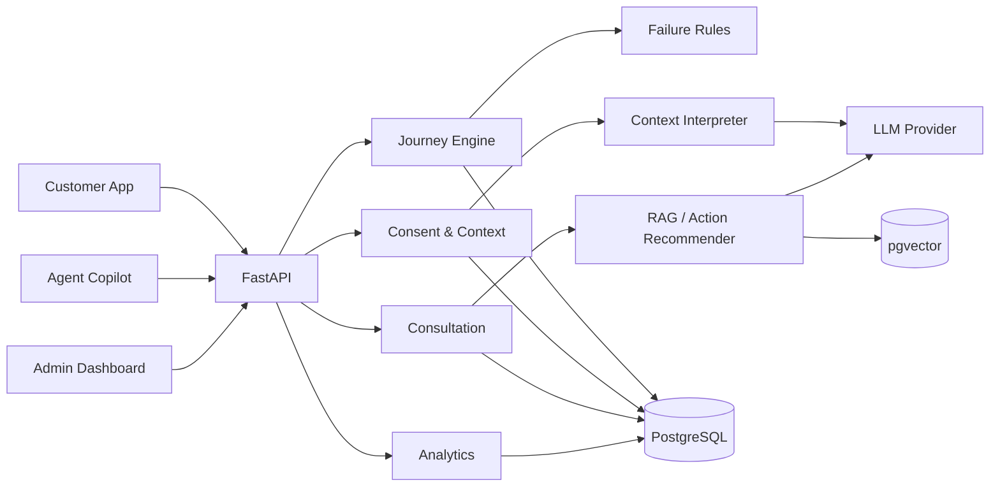
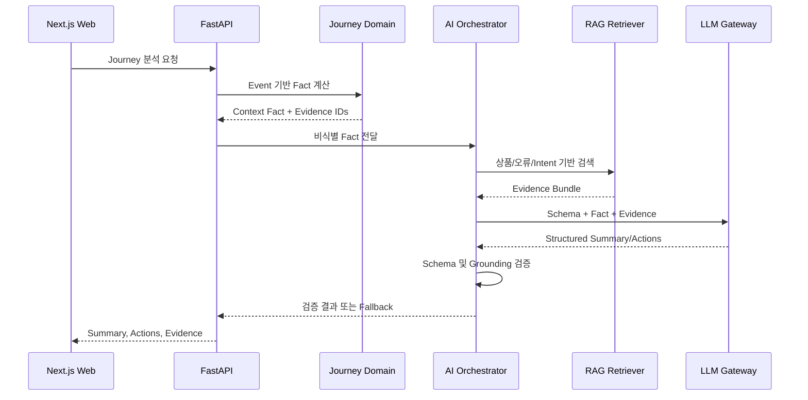

# FinPass AI MVP 아키텍처

## 1. 설계 목표

- 단일 대표 Journey를 끝까지 시연할 수 있는 수직 슬라이스를 먼저 완성한다.
- 업무 사실 계산, 생성형 AI 해석, 검색 근거를 명확히 분리한다.
- 전체 로그를 채널 간에 복제하지 않고 최소 Context만 전달한다.
- 초기에는 모듈형 모놀리스로 개발하되 도메인 경계를 유지한다.
- 외부 데이터와 LLM이 없어도 Seed 데이터와 규칙 기반 Fallback으로 데모가 동작하게 한다.

## 2. 권장 기술 스택

| 계층 | 선택 | 비고 |
| --- | --- | --- |
| Frontend | Next.js, TypeScript | Customer, Agent, Admin을 하나의 앱 내 route group으로 시작 |
| UI | Tailwind CSS, shadcn/ui | 역할별 공통 컴포넌트 재사용 |
| Chart | Recharts | Funnel, 오류 분포, 채널 전환 |
| Backend | FastAPI, Python | 데이터·AI 실험과 빠른 API 개발에 적합 |
| ORM/Migration | SQLAlchemy 2, Alembic | 명시적 모델과 마이그레이션 |
| Database | PostgreSQL, pgvector | 업무 데이터와 Vector 검색 통합 |
| AI | OpenAI 호환 Structured Output | Provider 인터페이스로 격리 |
| ML/Data | scikit-learn, pandas 또는 polars | 규칙 Baseline 평가와 데이터 처리 |
| Test | pytest, Playwright | API·도메인·E2E 검증 |

MVP 배포 단위는 `web`, `api`, `worker`(선택), `postgres`로 제한한다. 초기에는 별도 Message Broker 없이 요청 처리 또는 DB Job Table로 충분하다.

## 3. 논리 아키텍처



## 4. AI 웹서비스 패키지 구조

```text
finpass/
├── apps/
│   ├── web/                         # Next.js 통합 웹
│   │   ├── src/app/
│   │   │   ├── (customer)/          # 신청, 오류, 동의, Resume
│   │   │   ├── (agent)/             # Timeline, AI Summary, 상담
│   │   │   └── (admin)/             # KPI, Funnel, 오류 분석
│   │   ├── src/features/            # journey/context/consultation/analytics
│   │   ├── src/components/          # 역할에 독립적인 UI
│   │   └── src/lib/                 # API client, auth, telemetry
│   ├── api/                         # FastAPI
│   │   ├── app/api/v1/              # Router와 HTTP schema
│   │   ├── app/modules/             # 도메인별 Vertical Slice
│   │   │   ├── journey/
│   │   │   ├── failure_detection/
│   │   │   ├── consent/
│   │   │   ├── context_pass/
│   │   │   ├── consultation/
│   │   │   └── analytics/
│   │   ├── app/ai/
│   │   │   ├── gateway/             # LLM provider, timeout, usage
│   │   │   ├── context/             # Fact Builder, Interpreter
│   │   │   ├── actions/             # Next Best Action
│   │   │   ├── insights/            # Admin AI Insight
│   │   │   ├── prompts/             # 버전별 Prompt
│   │   │   ├── schemas/             # Structured Output
│   │   │   ├── guardrails/          # PII, grounding 검증
│   │   │   └── fallback/             # AI 장애 시 정적 결과
│   │   ├── app/rag/
│   │   │   ├── ingestion/           # parse, normalize, chunk
│   │   │   ├── embeddings/
│   │   │   ├── retrieval/           # metadata/vector search
│   │   │   ├── reranking/
│   │   │   └── citations/           # 출처와 Evidence Bundle
│   │   └── app/infrastructure/       # DB, pgvector, config, logging
│   └── worker/                       # 선택: embedding/집계 Job
├── packages/
│   ├── contracts/                   # OpenAPI 타입, Event/AI schema
│   ├── ui/                          # 공통 Design System
│   ├── config/                      # TypeScript/Lint 공통 설정
│   └── observability/               # trace/metric 규약
├── ai/
│   ├── evals/                       # Summary/Grounding/Retrieval 평가
│   ├── datasets/                    # Golden Set과 Fixture
│   └── experiments/                 # 런타임과 분리한 실험 코드
├── ml/
│   ├── failure_detection/
│   └── intent_classification/
├── data/
│   ├── raw/                         # Git 제외
│   ├── processed/
│   └── synthetic/
├── pipelines/
│   ├── inspect/
│   ├── normalize/
│   ├── synthetic/
│   └── index/
├── knowledge/
│   ├── financial_manual/
│   ├── product_catalog/
│   └── taxonomy/
├── tests/                           # Contract와 E2E
├── infra/                           # Compose, migration, 배포 설정
└── docs/
```

Frontend 세 개를 별도 배포 앱으로 나누기보다 한 Next.js 앱의 역할별 Route Group으로 시작한다. 인증 경계나 배포 주기가 달라질 때 앱을 분리한다. `packages/contracts`는 OpenAPI와 JSON Schema에서 생성해 Web과 API가 타입을 중복 정의하지 않게 한다.

### 패키지 의존성 원칙

```text
Web Feature → API Contract → Backend Application → Domain
                                      ↓
                          AI Orchestration / RAG
                                      ↓
                        Infrastructure / External LLM
```

- Web은 LLM이나 Vector DB를 직접 호출하지 않고 FastAPI만 호출한다.
- Domain은 FastAPI, ORM, LLM SDK에 의존하지 않는 순수 업무 규칙으로 유지한다.
- AI 계층은 Journey의 비식별 Fact Object를 입력받으며 DB 모델을 Prompt에 직접 넘기지 않는다.
- RAG 계층은 검색과 근거 구성을 담당하고 최종 조치 생성은 AI Action 계층이 담당한다.
- `ai/experiments`의 Notebook과 실험 코드는 제품 런타임에서 import하지 않는다.
- Prompt, AI Schema, Knowledge 문서에 버전을 부여해 결과를 재현한다.
- 대용량 데이터와 Embedding은 Git에서 제외하고 Manifest와 작은 Fixture만 관리한다.

### AI 요청 처리 경로



확정적 업무 사실, 검색 근거, 생성 문장을 분리하고 Web에는 검증이 끝난 결과만 노출한다.

## 5. Backend 모듈 책임

| 모듈 | 책임 |
| --- | --- |
| Journey | Event 수집, 순서·중복 검증, 상태 Projection, Resume 지점 계산 |
| Failure Detection | Feature 계산, 규칙 점수, 등급과 판정 근거 생성 |
| Consent | 공유 범위, 목적, 만료와 철회 상태 관리 |
| Context | 동의 검증, 최소 Context Pass 생성, AI 요약과 근거 연결 |
| Consultation | 상담 시작·종료, 후속 조치, 요청 서류, Reverse Handoff |
| RAG | 문서 정규화, Chunk·Embedding, 검색, 추천 조치 Grounding |
| Analytics | KPI 집계, Funnel, 오류·채널·Segment 분석 |
| AI Gateway | Structured Output, Timeout/Retry, 모델·Prompt 버전, Fallback |

## 6. 핵심 데이터 모델

| Entity | 핵심 필드 |
| --- | --- |
| Customer | `id`, `segment`, 최소 데모 특성 |
| FinancialProduct | `id`, `type`, `name`, `requirements`, `version` |
| Journey | `id`, `customer_id`, `product_id`, `status`, `current_step`, timestamps |
| JourneyEvent | `id`, `journey_id`, `session_id`, `channel`, `type`, `step`, `status`, 오류·재시도·시간 |
| Consent | `id`, `journey_id`, `scope`, `purpose`, `status`, `expires_at` |
| ContextPass | `id`, `journey_id`, `consent_id`, context fields, `summary`, `expires_at`, `version` |
| Intent | `id`, `journey_id`, `taxonomy_code`, `confidence`, `source` |
| Consultation | `id`, `journey_id`, `context_pass_id`, `status`, 결과, `resume_step` |
| RecommendedAction | `id`, `consultation_id`, action, rationale, evidence, `selected_at` |

### 모델링 원칙

- `JourneyEvent`는 append-only 원장으로 취급한다.
- `Journey.current_step/status`는 빠른 조회를 위한 Projection이다.
- 클라이언트가 생성한 `event_id` 또는 idempotency key로 중복 저장을 방지한다.
- LLM 결과에는 `model`, `prompt_version`, `schema_version`, 근거 ID를 보관한다.
- Context Pass는 원본 로그가 아니라 최소 요약과 참조를 보유한다.

## 7. Journey 상태 모델

주요 상태:

`IN_PROGRESS → ASSISTANCE_RECOMMENDED → SUPPORT_REQUESTED → IN_CONSULTATION → ACTION_REQUIRED → RESUMED → COMPLETED`

예외 상태는 `ABANDONED`, `EXPIRED`, `CANCELLED`로 분리한다. 상태 전이는 Domain Service에서만 수행하고 허용되지 않은 역행은 거부한다. 상담 완료 시 `resume_step`을 저장하며, Customer App은 서버가 반환한 재개 가능 단계만 연다.

## 8. Failure Detection Baseline

MVP 규칙 예시:

| 조건 | 점수 예시 |
| --- | ---: |
| 동일 단계 오류 1회 | +10 |
| 동일 단계 오류 3회 이상 | +40 |
| 예상 시간의 2배 초과 | +20 |
| 같은 화면 반복 3회 이상 | +15 |
| 이전 세션 동일 실패 | +20 |
| 상담 요청 | 최소 `ASSISTANCE_RECOMMENDED` |

점수 구간은 Synthetic 데이터와 시나리오 테스트로 조정한다. 결과에는 총점뿐 아니라 `rule_id`, 입력 Feature, 기여 점수를 기록한다. 이후 ML 모델은 동일한 Feature Contract를 사용해 Shadow 평가할 수 있다.

## 9. AI와 RAG 경계

### Context Interpretation

1. Backend가 Event에서 사실을 계산한다.
2. PII가 제거된 Fact Object를 LLM에 전달한다.
3. LLM이 고정 JSON Schema로 요약·Intent·주의사항을 반환한다.
4. Schema와 근거 참조를 검증한 뒤 저장한다.
5. 실패 시 Fact Object 기반 Template Summary를 반환한다.

### Next Best Action

1. 현재 단계, 오류 코드, Intent, 상품을 검색 조건으로 만든다.
2. 매뉴얼을 우선 검색하고 유사 상담 사례를 보조 검색한다.
3. 문서 ID, 버전, 관련 구절을 Evidence Bundle로 구성한다.
4. LLM이 Evidence Bundle 안에서만 최대 3개 조치를 생성한다.
5. 근거 없는 후보는 제거하고 상담원에게 자동 실행 없이 표시한다.

금융상품 조건과 업무 절차는 상담 사례보다 높은 우선순위를 갖는다. 검색 결과가 부족하면 추측 대신 `추가 확인 필요`를 반환한다.

## 10. API 설계

기본 초안:

| Method | Endpoint | 역할 |
| --- | --- | --- |
| POST | `/journeys` | Journey 시작 |
| POST | `/journeys/{id}/events` | 멱등 Event 기록 |
| GET | `/journeys/{id}` | 현재 상태와 Timeline 조회 |
| POST | `/journeys/{id}/analyze` | Failure·Context 분석 |
| POST | `/journeys/{id}/consents` | 공유 동의 생성 |
| POST | `/journeys/{id}/context-passes` | 동의 기반 Context Pass 생성 |
| GET | `/context-passes/{id}` | 유효성 검증 후 조회 |
| GET | `/journeys/{id}/actions` | 추천 조치 조회·생성 |
| POST | `/consultations` | 상담 시작 |
| POST | `/consultations/{id}/complete` | 결과와 Resume 지점 확정 |
| GET | `/analytics/journeys` | Journey KPI/Funnel |
| GET | `/analytics/failures` | 실패·오류 집계 |
| GET | `/analytics/insights` | 집계 기반 AI Insight |

쓰기 API는 `Idempotency-Key`를 지원한다. 오류 응답은 공통 코드, 사용자 메시지, 추적 ID를 포함한다.

## 11. 보안·개인정보·감사

- 동의는 목적, 항목, 수신 채널, 만료시간을 명시한다.
- Context 조회 시 동의 상태와 만료를 매번 확인한다.
- LLM 입력에서 직접 식별자를 제거하거나 가명화한다.
- 상담원 조회와 Context 생성·열람·철회를 Audit Log에 기록한다.
- 개발용 원본 데이터는 저장소에 커밋하지 않고 출처, 라이선스, 처리 이력만 관리한다.
- 실제 금융 판단이나 대출 승인 결정을 AI 추천 범위에 포함하지 않는다.

## 12. 관측성과 운영

최소 관측 항목:

- API 요청 추적 ID와 처리시간
- Journey/Event 처리 실패율
- Failure 판정 등급과 Rule 분포
- LLM 지연, 실패, Schema 검증 실패, Fallback 비율
- RAG 검색 결과 수와 근거 누락률
- Context Pass 생성·조회·만료 건수

모든 지표는 고객 원문이나 민감정보 없이 기록한다.

## 13. 주요 아키텍처 결정

| 결정 | 이유 | 재검토 시점 |
| --- | --- | --- |
| 모듈형 모놀리스 | MVP 변경 속도와 트랜잭션 단순성 | 팀·트래픽·배포 주기 분화 시 |
| PostgreSQL + pgvector | 운영 요소 최소화 | 검색량·정확도 요구 증가 시 |
| 규칙 기반 Failure 우선 | 설명 가능성과 초기 라벨 부족 | 평가 데이터 확보 후 |
| 동기 처리 + 선택적 DB Job | Kafka 없는 단순한 MVP | 처리량·비동기 요구 증가 시 |
| 단일 Next.js 앱 | UI 공통화와 E2E 속도 | 역할별 독립 배포 필요 시 |
