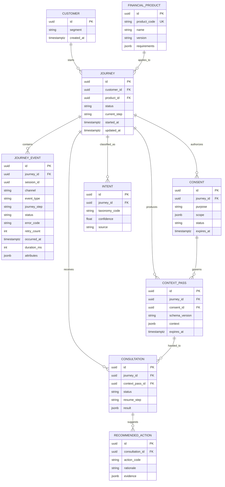

# FinPass Unified Data Model v1

## ERD

## Event 원장과 Projection

`JourneyEvent`는 수정하지 않는 원장이다. `Journey.status`와 `Journey.current_step`은 Event를 반영한 조회용 Projection이며, 상태가 불일치하면 Event 원장에서 재생성할 수 있어야 한다.

이벤트 중복 방지 키는 `event_id`다. Phase 1의 Event API는 추가로 `Idempotency-Key`를 받아 동일 요청의 결과를 재사용한다.

## 시간 및 민감정보

- 모든 시각은 UTC `timestamptz`로 저장한다.
- 고객 식별정보는 `Customer`의 별도 보호 영역에 두며 Event `attributes`에 넣지 않는다.
- 허용되지 않은 임의 필드는 API 계약에서 거부한다.
- LLM에는 UUID 대신 요청 단위 가명 식별자를 사용한다.
