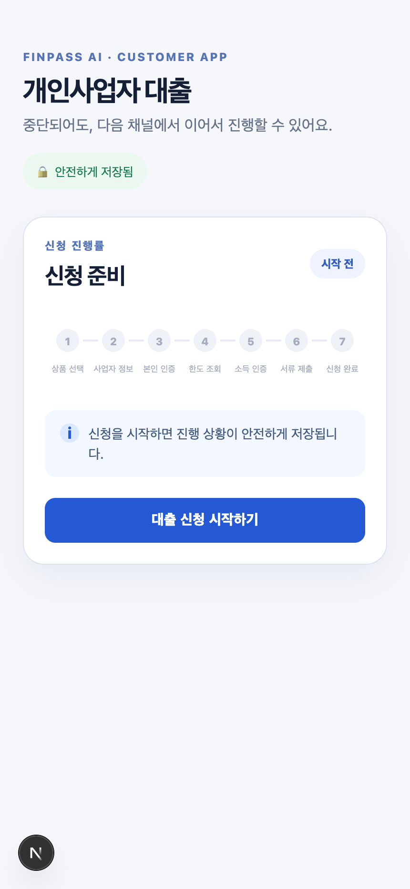
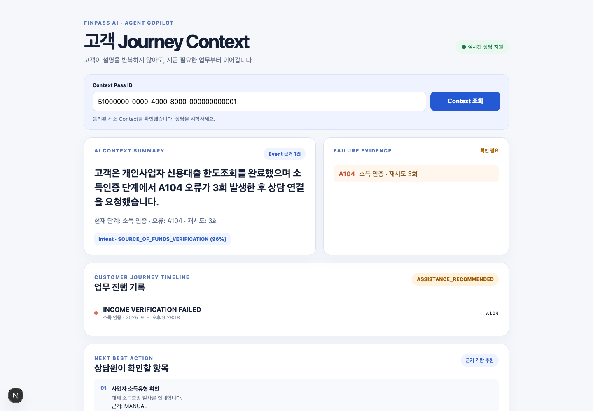
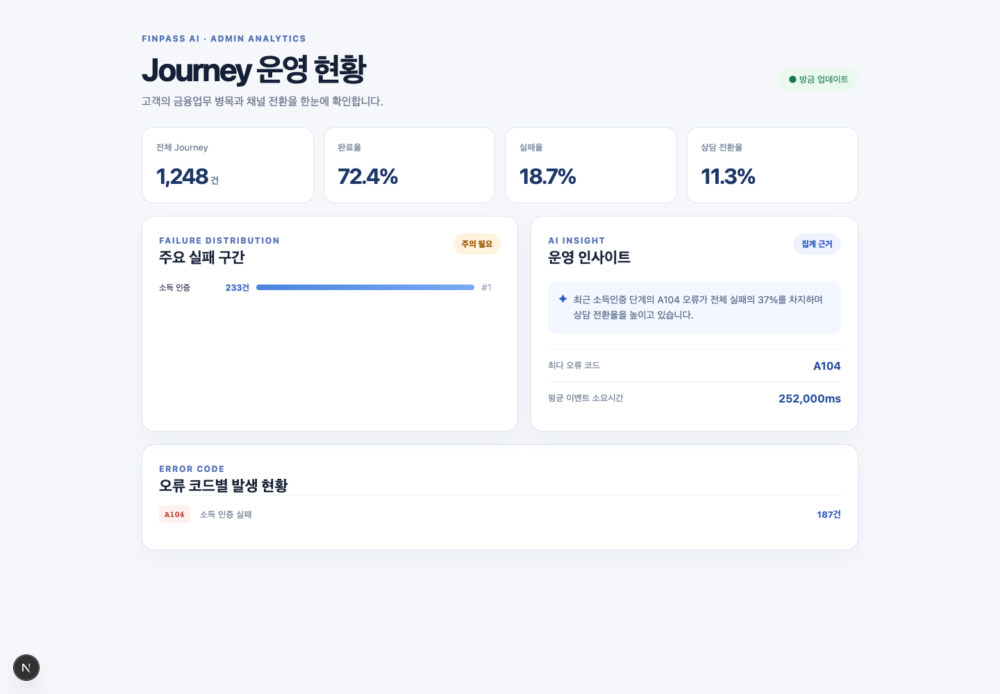

# 공모전 기획서용 MVP 화면 캡처

실행 가능한 MVP에서 FinPass AI의 핵심 가치를 보여주는 대표 화면이다.

## 1. Customer Journey Continuity

고객이 금융업무를 시작하고, 진행 단계가 안전하게 저장되어 채널이 바뀌어도
중단 지점부터 이어갈 수 있음을 보여준다.

## 2. Agent Copilot Context Pass

고객이 반복 설명하지 않아도 상담원은 Context Pass를 통해 현재 단계, 실패
근거, 고객 Intent, AI 요약, 다음 조치를 한 화면에서 확인한다.

## 3. Admin Journey Intelligence

개별 오류 로그를 넘어 전체 Journey의 완료율, 실패 구간, 오류 코드, 상담
전환율과 AI 운영 Insight를 함께 제공한다.

> 캡처는 로컬 MVP의 재현 가능한 시나리오 데이터로 생성했으며, 실제 금융기관
> 고객 정보는 포함하지 않는다.
